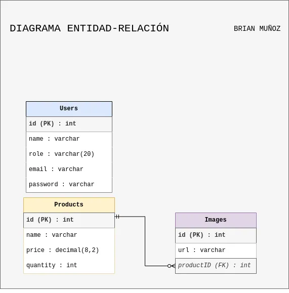

# API REST para la gestión de stock de productos

Esta API REST esta diseñada para como aplicación interna de una empresa con depósito

## Tecnologías Utilizadas

- Laravel 11.31
- PHP 8.2
- MySql
- Docker

## Despliegue del proyecto

Una vez clonado el directorio, dirigirse a la carpeta del proyect

```bash
  cd laravelapiproducts
```
Para correr el proyecto recomiendo usar el siguiente comando, o por defecto puedes construir el proyecto primero y luego correrlo.

```bash
  docker compose up -d --build
```
Ejecutar migraciones y crear usuario admin

```bash
  docker compose exec app php artisan migrate --seed
```
## Usuario por defecto

Email: admin@example.com
Password: password


## Diagrama entidad-relación



